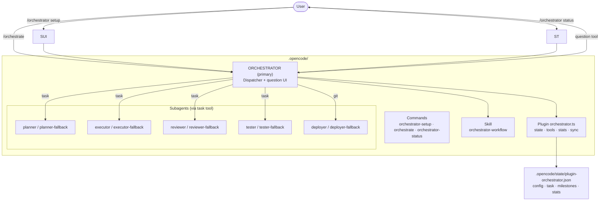

# Pain Packer Orchestrator

An autonomous agent orchestrator for OpenCode that manages the complete development lifecycle: **plan → review → implement → review → test → commit → docs**.

## Installation

Copy the `.opencode/` folder into your project root. OpenCode automatically loads plugins, commands, agents, and skills from this directory on startup.

```bash
cp -r /path/to/pain-packer-orchestrator/.opencode /your/project/
```

Restart OpenCode. The plugin initializes with default configuration.

## Usage

### 1. Configure models and workflow

```
/orchestrator setup
```

An interactive form appears in the chat with:
- Model selectors for **Planning**, **Implementation**, **Review**, and **Repetitive Tasks** (each with primary and fallback).
- Checkboxes for workflow toggles: confirm plan, auto-fix, run tests, auto-commit, show costs.
- Numeric fields: max attempts, timeout, cost threshold.
- **Save Configuration** / **Cancel** buttons.

Selections are persisted to `.opencode/state/plugin-orchestrator.json` and synced to agent frontmatter.

### 2. Run an orchestration

```
/orchestrate "Implement the appointments module with CRUD API"
```

The Orchestrator dispatcher:
1. Creates a progress checklist (live in the UI).
2. Delegates to **Planner** → produces a milestone plan.
3. Asks you to **Approve / Modify / Cancel** the plan.
4. On Approve: **Executor** implements milestones, **Reviewer** validates, **Tester** runs tests, **Deployer** commits and pushes.
5. Updates documentation.
6. Prints cost estimate (if enabled).

### 3. Check status

```
/orchestrator status
```

Shows the current task, recent milestones, and model usage statistics (tokens, cost, success rate).

## Configuration

All settings live in `.opencode/state/plugin-orchestrator.json`:

| Section | Keys |
|---|---|
| `planning` | `primary`, `fallback` |
| `implementation` | `primary`, `fallback` |
| `review` | `primary`, `fallback` |
| `repetitive` | `primary`, `fallback` |
| Toggles | `confirmPlanBeforeImplementation`, `autoFixIssues`, `runTestsAfterImplementation`, `autoCommit`, `showCostEstimates` |
| Limits | `maxAttemptsPerPhase`, `timeoutPerPhaseSeconds`, `costThresholdForConfirmationUsd` |

The file is created on first run with sensible defaults. Run `/orchestrator setup` to change them.

## How It Works



- **Plugin** — Persists state, exposes tools (`orchestrator_get_state`, `orchestrator_save_config`, `orchestrator_start_task`, `orchestrator_record_milestone`), tracks token usage and cost via event hooks, syncs selected models to agent `model:` frontmatter.
- **Orchestrator agent** — Runs the workflow, drives the `question` UI for plan approval and setup, maintains the `todowrite` progress checklist.
- **Subagents** — Specialized roles with dedicated models; fallback twins for resilience.
- **Skill** — Defines the workflow, plan format, security gates, commit rules, documentation standards.

## Persistence & Resume

State is saved to `.opencode/state/plugin-orchestrator.json` after every milestone. If OpenCode restarts, `/orchestrator status` shows the last task and phase. The `experimental.session.compacting` hook injects the current task into the compaction prompt so a compacted session can resume.

## Security Gates

The Orchestrator pauses for human confirmation (via `question`) before:

- Database migrations / schema changes.
- Destructive commands (`rm -rf`, `git push --force`, `drop database`, production dep removal).
- Dependency upgrades that may break the build.
- Any production infrastructure modification.

## Conventions

- **Language**: English only (code, commits, docs, UI).
- **Commits**: Conventional Commits, one per milestone, `type(scope): subject`.
- **Code style**: `const` by default, early returns, no `any`, explicit return types, Zod for validation.
- **Testing**: Unit tests for pure logic; integration tests mocked.

## Troubleshooting

- **Plugin not loading**: Check OpenCode logs (`/help` → Logs). The plugin uses `client.app.log()` for structured output.
- **Agent model not updated**: Run `/orchestrator setup` and Save; the plugin rewrites `model:` in `.opencode/agents/*.md`.
- **No test command found**: The Tester detects `npm test`, `pnpm test`, `bun test`, `vitest run`, `jest`, `pytest`. Add a test script to `package.json` if missing.

## License

MIT